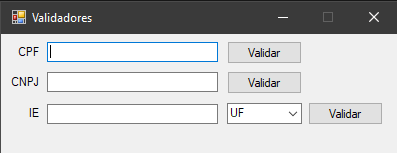

# Validador de Documentos

Programa simples de validação de CPF, CNPJ e IEs. 

## Funcionalidades



- Aplicação Windows
- Validação de CPF
- Validações de CNPJ: padrão atual e novo
- Validações de IE: Paraná, Acre, Tocantins, Pernambuco (padrão atual e novo) 


## Tecnologias
  - C#
  - Windows Forms
  - .NET Framework 4.7.2
## Rodando localmente

Instale as dependências

```bash
  https://dotnet.microsoft.com/en-us/download/dotnet-framework/net472
```

Clone o projeto

```bash
  git clone https://github.com/Je0225/Validadores.git
```

Entre no diretório do projeto

```bash
  cd  \Validadores\bin\Debug\Validadores.exe
```

